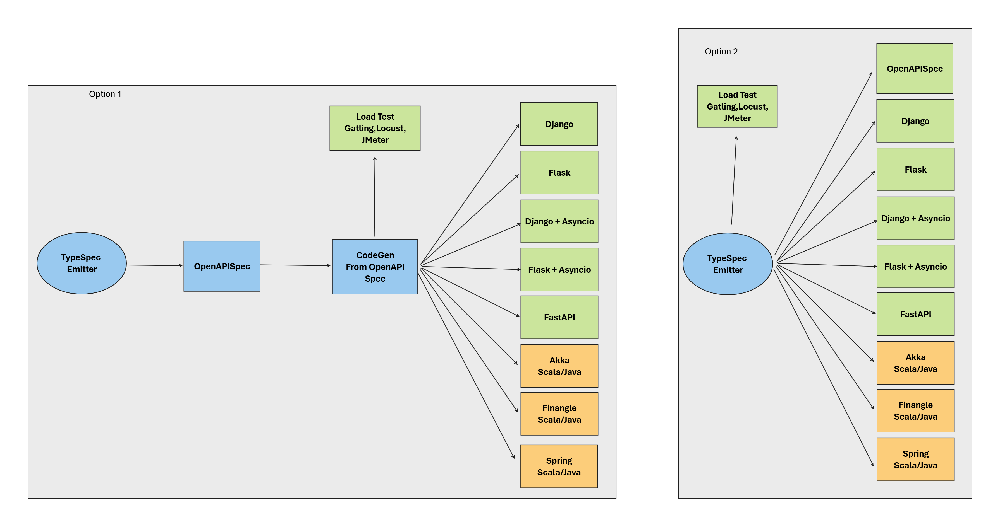

# TypeSpec

**TypeSpec es un lenguaje de código abierto, creado por Microsoft, para definir APIs de forma concisa y generar automáticamente especificaciones, código y documentación** .

Usualmente al desarrollar APIs primero codificamos y después creamos contratos con openapi spec. Es decir, es code first. Hay bastantes trabajos para hacer api design first, sin embargo usando openapi se vuelve algo muy complicado desde el punto de vista del desarrollador. Typespec nos permite realmente desarrollar desde api design first!

## Módulo 1: Introducción a TypeSpec

1. **Configuración del entorno**
2. **¿Qué es TypeSpec?**
3. **Sintaxis básica**
4. **Ejercicio práctico**

## Módulo 2: TypeSpec Tipos y Namespaces

1. **Sistema de tipos avanzado**
2. **Organización de código**
3. **Decoradores personalizados**
4. **Ejercicio práctico:**

## Módulo 3: Introducción a Emitters

1. **¿Qué es un emitter?**
2. **Arquitectura de un emitter**
3. **Configuración de emitters**
4. **Ejercicio práctico:**

## Módulo 4: Creando un Emitter para Python

1. **Planificación del emitter**
2. **Implementación básica**
3. **Transformación de modelos a clases Python**
4. **Generación de APIs**
5. **Ejercicio práctico:**

## Módulo 5: Emitter Avanzado y Pruebas

1. **Características avanzadas**
2. **Testing del emitter**
3. **Publicación y distribución**
4. **Ejercicio final:**

## Proyecto 

<div>

</div>


## Estructura de este repositorio

```bash
.
├── docs
│   ├── images         # todas las imagenes estarán aqui
│   ├── module_01
│   ├── module_02
│   ├── module_03
│   ├── module_04
│   ├── services       # La descripción de los servicios estarán aqui
│   └── guidelines.md  # Guías para contribuir en este proyecto
├── Dockerfile
├── docker-compose.yml
├── Makefile
├── mkdocs.yml         # Configuración de nuestro servicio de documentación
├── package.json
├── src/
│   ├── containers     # Los Dockerfiles/Dockercompose de los servicios
│   ├── db             # Los DDLs de los servicios
│   ├── services       # El código de downstream services estará aquí
│   └── main.tsp       # Archivo principal TypeSpec
└── tsp-output/        # Directorio para los archivos generados
```


## Recursos Adicionales

1. [Documentación oficial de TypeSpec](https://microsoft.github.io/typespec/)
2. [Repositorio de emitters oficiales](https://github.com/microsoft/typespec)
3. [Ejemplo de emitter personalizado](https://github.com/Azure/typespec-azure)
4. [Python Pydantic documentation](https://docs.pydantic.dev/)
5. [Documentación de Flask](https://flask.palletsprojects.com/es/stable/)
6. [Documentación de Django](https://docs.djangoproject.com/es/5.2/)
7. [Documentación de FastAPI](https://fastapi.tiangolo.com/)
8. [Documentación de dbt](https://www.startdataengineering.com/post/dbt-data-build-tool-tutorial/)
9. [Documentación de Smithy](https://smithy.io/)
10. [Documentación AsyncAPI](https://www.asyncapi.com/en)
11. [Alloy-framework](https://github.com/alloy-framework/alloy)

