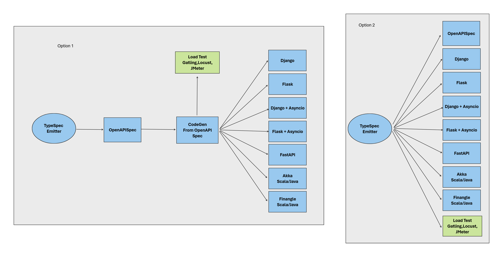

# Curso: Generación de Código Python con TypeSpec y Emitters

## Módulo 1: Introducción a TypeSpec

### Objetivos:
- Entender qué es TypeSpec y sus casos de uso
- Configurar el entorno de desarrollo
- Aprender los conceptos básicos de TypeSpec

1. **¿Qué es TypeSpec?**
    - Lenguaje para describir APIs y modelos de datos
    - Ventajas sobre OpenAPI/Swagger
    - Casos de uso comunes

2. **Configuración del entorno**
    - Instalación de Node.js y npm
    - Instalación del compilador TypeSpec

3. **Sintaxis básica**
    - Modelos y propiedades
    - Operaciones y parámetros
    - Decoradores y metadatos

4. **Ejercicio práctico:**
    - Crear un archivo `.tsp` básico
    - Definir un modelo simple y compilarlo

## Módulo 2: TypeSpec Tipos y Namespaces

### Objetivos del Módulo 2

- Dominar conceptos avanzados de TypeSpec
- Aprender a usar namespaces e interfaces
- Entender el sistema de tipos

1. **Sistema de tipos avanzado**
    - Uniones e intersecciones
    - Tipos genéricos
    - Tipos template

2. **Organización de código**
    - Namespaces y imports
    - Interfaces y operaciones
    - Extensibilidad con `extends` y `mixins`

3. **Decoradores personalizados**
    - Creación de decoradores
    - Metadatos y validación

4. **Ejercicio práctico:**
    - Modelar una API REST completa
    - Validar con decoradores personalizados

## Módulo 3: Introducción a Emitters

### Objetivos del módulo 3

- Entender el concepto de emitters en TypeSpec
- Explorar emitters existentes
- Prepararse para crear un emitter personalizado

1. **¿Qué es un emitter?**
    - Proceso de transformación de TypeSpec a otros lenguajes
    - Emitters oficiales (OpenAPI, Protobuf, etc.)

2. **Arquitectura de un emitter**
    - Fases de compilación
    - AST (Abstract Syntax Tree) de TypeSpec
    - Visitas y transformaciones

3. **Configuración de emitters**
    - Uso de emitters en proyectos
    - Opciones y configuración

4. **Ejercicio práctico:**
    - Generar OpenAPI desde TypeSpec
    - Examinar el output generado

## Módulo 4: Creando un Emitter para Python

### Objetivos del Módulo 4

- Implementar un emitter que genere código Python
- Aprender a transformar modelos TypeSpec a clases Python
- Generar código ejecutable

1. **Planificación del emitter**
    - Definir el alcance (¿models? ¿APIs? ¿ambos?)
    - Estructura de archivos de salida
    - Convenciones de nombres

2. **Implementación básica**
    - Crear un proyecto Node.js para el emitter
    - Configuración inicial

3. **Transformación de modelos a clases Python**
    - Mapeo de tipos TypeSpec a Python
    - Generación de clases Pydantic/Dataclasses
    - Manejo de relaciones entre modelos

4. **Generación de APIs**
    - Opciones: 
        - Flask, 
        - Django, 
        - FastAPI, 
        - Finangle, 
        - Akka, etc.
    - Rutas y métodos HTTP
    - Parámetros y respuestas

5. **Ejercicio práctico:**
    - Implementación de un emitter

## Módulo 5: Emitter Avanzado y Pruebas

### Objetivos del Módulo 5

- Mejorar el emitter con características avanzadas
- Implementar pruebas automatizadas
- Publicar el emitter

1. **Características avanzadas**
   - Soporte para documentación (docstrings)
   - Generación de imports
   - Manejo de namespaces como módulos Python

2. **Testing del emitter**
   - Configuración de pruebas con Jest/Mocha
   - Snapshots testing
   - Pruebas de regresión

3. **Publicación y distribución**
   - Empaquetado para npm
   - Documentación del emitter
   - Versionamiento

4. **Ejercicio final:**
   - Crear un emitter completo que:
     - Genere modelos Pydantic
     - Genere APIs FastAPI
     - Incluya documentación
   - Publicarlo en npm (opcional)

## Proyecto 

### Objetivos del Proyecto

- Aplicar todos los conocimientos adquiridos
- Crear un conjunto de emitters funcionales y útiles
    - Opción 1: Crear emitter de OpenAPI + Codegen.
    - Opción 2: Crear emitters de código.

### Requisitos

1. Definir un esquema TypeSpec complejo con:
    - Múltiples modelos relacionados
    - Operaciones CRUD
    - Validaciones personalizadas

2. Implementar un emitter que genere:
    - Modelos Python, Scala con todas las relaciones
    - API REST completa con FastAPI
    - Documentación automática

3. Probar el código generado:
    - Ejecutar el servidor Flask, Django, FastAPI, Akka, Finangle
    - Probar endpoints con load test usando Gatling, Locust
    - Validar el comportamiento

## Recursos Adicionales

1. [Documentación oficial de TypeSpec](https://microsoft.github.io/typespec/)
2. [Repositorio de emitters oficiales](https://github.com/microsoft/typespec)
3. [Ejemplo de emitter personalizado](https://github.com/Azure/typespec-azure)
4. [Python Pydantic documentation](https://docs.pydantic.dev/)
5. [Flask](https://flask.palletsprojects.com/es/stable/)
6. [Django](https://docs.djangoproject.com/es/5.2/)
7. [FastAPI documentation](https://fastapi.tiangolo.com/)

