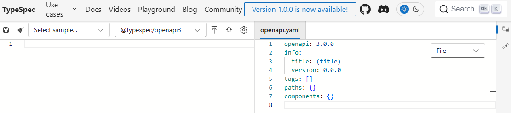

# Configuración de Entorno de Trabajo


En está sección describiremos como configurar un entorno de trabajo con TypeSpec.

Tendremos tres opciones para trabajar TypeSpec:

1. Playground [link](https://typespec.io/playground/)
2. Instalar localmente TypeSpec
3. Usar el entorno preconfigurado de este repositorio.

El curso contiene un entorno local preconfigurado el cual está configurado para realizar las practicas de typescript.

---

## Playground 

Typespec cuenta con un playground que usaremos para familiarizarnos con el lenguage y como principal herramienta de pruebas. La opción es simplemente ir al sitio [https://typespec.io/playground/](https://typespec.io/playground/).

Donde encontraremos un entorno de pruebas



## Instalación local de TypeSpec

Consiste normalmente de los siguientes dos pasos:

1. Instalación de Node.js y npm
2. Instalación del compilador TypeSpec

### Requerimientos


Los requirimientos básicos para trabajar con typespec son:

- `node.js 20 LTS`
- `npm 7+`


### Instalando typespec

El primer paso es instalar el compilador de typespec con la siguiente instrucción.

```bash title="Instalación de typespec compiler"
npm install -g @typespec/compiler
```


```bash title="Ejemplo de salida esperada"
added 73 packages in 3s

13 packages are looking for funding
  run `npm fund` for details
npm notice
npm notice New major version of npm available! 10.2.4 -> 11.0.0
npm notice Changelog: https://github.com/npm/cli/releases/tag/v11.0.0
npm notice Run npm install -g npm@11.0.0 to update!
npm notice
```

### Inciciar un Proyecto de TypeSpec

Ve a directorio donde crearas el proyecto. 

Para iniciar un proyecto de typespec usamos la instrucción:

```bash title="tsp init"
tsp init 
```

Nos mostrará 4 opciones:

```bash title="Salida de tsp init"
TypeSpec compiler v0.64.0

? Please select a template › - Use arrow-keys. Return to submit.
❯   Empty project       min compiler ver: 0.64.0 - Create an empty project.
    Generic REST API    min compiler ver: 0.64.0
    TypeSpec Library (With TypeScript)  min compiler ver: 0.64.0
    TypeSpec Emitter (With TypeScript)  min compiler ver: 0.64.0
```

- Crear proyecto vacio.
- Crear un REST API generica.
- Crear un nuevo paquete para agregar decoradores o linters a typespec.
- Crear un nuevo paquete que estará emitiendo typespec.

Nos mostrará opcion de nombrar el proyecto:

```bash title="Salida de Empty Project"
TypeSpec compiler v0.64.0

✔ Please select a template › Empty project      min compiler ver: 0.64.0
Create an empty project.
✔ Project name … example_01
✔ Do you want to generate a .gitignore file? … no

TypeSpec init completed. You can run `tsp install` now to install dependencies.
Project created successfully.
```

Al elegir un proyecto vacio creará los siguientes 3 archivos:

```bash title="Proyecto Vacio"
main.tsp
package.json
tpsconfig.yaml
```

donde

- `main.tsp` es un archivo vacio
- `tpsconfig.yaml` es un archivo vacio 

```bash title="package.json"
{
  "name": "example_01",
  "version": "0.1.0",
  "type": "module",
  "peerDependencies": {
    "@typespec/compiler": "latest"
  },
  "devDependencies": {
    "@typespec/compiler": "latest"
  },
  "private": true
}
```


### Compilación de un Proyecto de TypeSpec

La compilación la realizaremos usando la opción `compile`:

```bash title="Instrucción para Compilar"
tsp compile .
```

Esto generá una serie de archivos dependendiendo de la opción de creación, así como nuestra implementación en `main.tsp`.

```bash title="Salida de Compilación"
TypeSpec compiler v0.64.0

Compilation completed successfully.

No emitter was configured, no output was generated. Use `--emit <emitterName>` to pick emitter or specify it in the TypeSpec config.
```


## Entorno de trabajo usando este repositorio

### Documentación

Primero tendremos acceso a la documentación usando el comando

```bash title="Build y run documentación"
make up_docs
```

después basta con ir a [http://localhost:8080](http://localhost:8080)

En está página encontrarás todo el material.


Para este repositorio la estructura necesaria para typespec será:

```bash hl_lines="7-9" title="Archivos principales para TypeSpec"
.
├── Dockerfile
├── docker-compose.yml
├── Makefile
├── package.json
├── src/
│   ├── services       # El código de downstream services estará aquí
│   └── main.tsp       # Archivo principal TypeSpec
└── tsp-output/        # Directorio para los archivos generados
```

Nuestro Makefile nos ayudará con los siguientes puntos:

- Desarrollo persistente: Los archivos en `src/` se sincronizan con el contenedor gracias al volumen montado.
- Salida accesible: Los archivos generados se guardan en `tsp-output/` en tu host.
- Dependencias aisladas: El directorio `node_modules` se mantiene persistente pero aislado en un volumen.
- Comandos útiles: El Makefile proporciona atajos para las operaciones comunes.
- Extensible: Podremos añadir más servicios a `docker-compose.yml`.


para empezar a usar este entorno correr las siguientes instrucciones:


```bash title="Crear la imagen de docker"
make build
```

```bash title="Salida make build"
UID=1000 GID=1000 docker-compose build
Building typespec-dev
[+] Building 0.7s (10/10) FINISHED                                                                       docker:default
 => [internal] load build definition from Dockerfile                                                               0.0s
 => => transferring dockerfile: 562B                                                                               0.0s
 => [internal] load metadata for docker.io/library/node:20-alpine                                                  0.7s
 => [internal] load .dockerignore                                                                                  0.0s
 => => transferring context: 2B                                                                                    0.0s
 => [1/6] FROM docker.io/library/node:20-alpine@sha256:be56e91681a8ec1bba91e3006039bd228dc797fd984794a3efedab325b  0.0s
 => CACHED [2/6] RUN apk update && apk add --no-cache     bash     git     curl     openssh-client     nodejs      0.0s
 => CACHED [3/6] RUN chown -R node:node /usr/local/lib/node_modules                                                0.0s
 => CACHED [4/6] RUN chown -R node:node /usr/local/bin/                                                            0.0s
 => CACHED [5/6] WORKDIR /app                                                                                      0.0s
 => CACHED [6/6] RUN npm install -g @typespec/compiler                                                             0.0s
 => exporting to image                                                                                             0.0s
 => => exporting layers                                                                                            0.0s
 => => writing image sha256:becfcc269b2fee3a04b45d834d437bf6efcf120667877e41c2e98f4e4340b1a2                       0.0s
 => => naming to docker.io/library/typespec-dev                                                                    0.0s
```


```bash title="Iniciar el contendor de docker"
make up
```

```bash title="Salida make up"
UID=1000 GID=1000 docker-compose up -d
Creating network "curso_typespec_default" with the default driver
Creating typespec-dev ... done
```

```bash title="Conectarnos al contendor de docker"
make shell
```

```bash title="Salida make shell"
docker exec -it typespec-dev sh
/app $
```


```bash title="Compilar el archivo de typespec"
make compile
```

```bash title="Ejecutar el watch de typespec"
make watch
```


Si ya no trabajaras con este entorno puede pararlo con:

```bash title="Detener contenedor"
make clean
```


