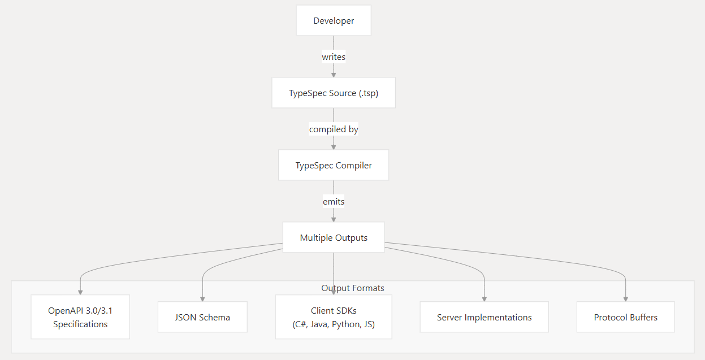
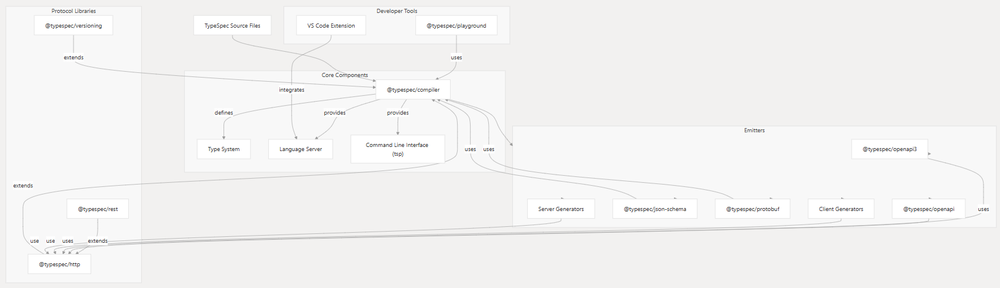

# ¿Qué es TypeSpec?


[Typespec Docs](https://typespec.io/docs/)


TypeSpec es un lenguaje de definición/descripción de API desarrollado por Microsoft, el cual es agnostico a los lenguages de programación (DSL). Diseñado especialmente para crear APIs, en principio esto es posible a partir del diseño de la data de nuestros servicios.

Al ser una asbtracción de OpenAPI nos permite especificar componentes importantes de una API, cosas como:

- Visibillidad
- Autorización
- Dominios
    - Modelos
    - Campos(Fields)
    - Joins
- Filtrado
- Errores


## ¿Por qué queremos TypeSpec?

Hoy en día los sistemas de datos son ecosistemas donde interactuan y tienen relación decenas o cientos de servicios, donde unos evolucionan y otros simplemente desaparecen. Lo cual fue parte de la razón por la cual surgieron Frameworks/Protocolos como Thrift y gRPC para la comunicación entre servicios, utilizados en arquitecturas distribuidas. Ambos permiten que diferentes sistemas o servicios se comuniquen de manera eficiente usando como principal herramienta un Lenguaje de definición de interfaces (IDL) el cual permite definir estructuras de datos y servicios en un archivo. Aunque tiene muchas cualidades una de sus principales restricciones es que trabaja **sin contrato estricto** lo que significa que permite evolución de APIs pero puede generar problemas de compatibilidad. Asi que nuestras APIs siguen dependiendo de los Schemas, esos contratos entre APIs y clientes.

Aunque OpenApi se convirtio en una especificación en 2015/16 no fue si no hasta 2020/21 que surgieron más herramientas para aprovechar OpenApi como:

- TypeSpec (Microsoft)
- Smithy (Amazon)

### TypeSpec cubre la parte del modelado de APIs independientemente de lenguage utilizado para la implementación de la API:

- Permite definir contratos de API con tipos fuertes y relaciones complejas.
- Soporta **herencia**, **composición** y generics (algo que Thrift y gRPC no tienen de forma nativa).

### Desde un solo archivo TypeSpec, puedes generar:

- OpenAPI (Swagger) para REST.
- gRPC (usando protobuf).
- Documentación automática.
- Clientes/Servidores en varios lenguajes.


## Flujo de Trabajo

<h2>El flujo de trabajo con TypeSpec</h2>





Sus características clave:

- Descripción de APIs: TypeSpec permite definir la forma de las APIs (Application Programming Interfaces), incluyendo sus entradas, salidas y comportamientos.
- Generación de código: A partir de las definiciones en TypeSpec, se puede generar automáticamente código para diferentes propósitos:
    - Clientes: Código para que otros sistemas interactúen con la API.
    - Servidores: Código para implementar la lógica de la API.
    - Documentación: Documentación clara y concisa de la API.
- Multi-protocolo: TypeSpec es compatible con diversos protocolos de comunicación, como REST, gRPC y otros.
- Extensible: Es un lenguaje altamente extensible que permite crear patrones y bibliotecas reutilizables para diferentes aspectos de las APIs.
- Linter integrado: Incluye un sistema de linter que ayuda a detectar posibles problemas y anti-patrones en las definiciones de API.

Por el momento cuenta con dos librerías que estudiaremos a fondo, sin embargo hay más en desarrollo:

- Http
- OpenAPI
- Rest (En desarrollo)
- Events (En desarrollo)
- SSE (En desarrollo)
- Streams (En desarrollo)
- Versioning (En desarrollo)
- Xml (En desarrollo)

Donde cada libreria cuenta con diferentes elementos, donde los más básicos son:

- Tipos de datos
- Decoradores
- Js api


## Ventajas sobre OpenAPI/Swagger

TypeSpec ofrece varias ventajas significativas sobre OpenAPI/Swagger, especialmente en escenarios de desarrollo moderno y a gran escala. 

Es un Domain Specific Language (DSL), es decir, es un lenguage con sintaxis concisa y capacidades de abstracción.

### Modelos, Operaciones y Relaciones

Permite definir modelos, operaciones y relaciones con tipos fuertes, herencia, genéricos y decoradores.

Por ejemplo:

#### TypeSpec

```yaml title="Endpoin User" linenums="1"
import "@typespec/http";

using Http;

@service               // Service
namespace Users {      // Namespace
  @route("/users")     // Path
  op list(): User[];   // Operation

  model User {         // Model
    @key id: string;   // Field
    name: string;      // Field
    age: int32;        // Field
  }
}
```

Esto describe un endpoint con las siguientes caracteristicas:

- Ruta (URL): `/users`
- Método HTTP: `GET` (implícito por la operación `list`)
- Namespace: `Users`
- Operación: `list()`
- Respuesta: Un array de objetos `User`


Mientras que en OpenAPI/Swagger se vería como:

#### OpenAPI/Swagger

```yaml title="Endpoint User" linenums="1"
openapi: 3.0.0
info:
  title: (title)
  version: 0.0.0
tags: []
paths:
  /users:
    get:
      operationId: list
      parameters: []
      responses:
        '200':
          description: The request has succeeded.
          content:
            application/json:
              schema:
                type: array
                items:
                  $ref: '#/components/schemas/User'
components:
  schemas:
    User:
      type: object
      required:
        - id
        - name
        - age
      properties:
        id:
          type: string
        name:
          type: string
        age:
          type: integer
          format: int32
```


### Modularidad

Typespec soporta modularidad  a travez de namespaces, imports y templates. También permite extender modelos con `extends` o `mixins`.

Ejemplo:

```yaml title="User como Extension de Timestamp"
model Timestamps {
  createdAt: string;
  updatedAt: string;
}

model User extends Timestamps {
  id: string;
}
```

### Decoradores

Typespec usa decoradores para añadir metadatos específicos. (ej: `@route`, `@body`, `@doc`). 

Sin embargo tambien podemos crear decoradores custom para nuestros casos de uso.

Ejemplo:

```yaml title="Decorador doc" linenums="1"
@doc("Usuario del sistema")
model User {
  @minLength(3)
  name: string;
}
```

### Emitters

Typespec usa emitter para crear código específico y además permite crear versiones customizadas a nuestras necesidades que será nuestro principal objetivo en este curso.

- TypeSpec--> OpenAPI
- TypeSpec --> OpenAPI + Clases Python + Client SDK.

### Validación de Tipos

- Tiene un sistema de tipos avanzado (uniones, genéricos, templates).
- Detecta errores en tiempo de compilación.

Ejemplo:

```yaml
op getUser(id: string): User | Error;
```

## La Arquitectura de TypeSpec

El eje central de typespec es el `compiler`, sin embargo para los usuarios de typespec nuestro principal atención será alrededor de `Emitters`. Más adelante profundizaremos en los elementos de typespec para poder extender y customizar nuestras implementaciones.





## Plugin para Visual Studio Code

<div>
<a href="https://marketplace.visualstudio.com/items?itemName=typespec.typespec-vscode">Link a Plugin de VSCODE</a>
</div>


## Material Extra


- [Ejemplos de OpenAPI](https://learn.openapis.org/examples/)
- [Stripe OpenApi](https://github.com/stripe/openapi/blob/master/openapi/spec3.yaml)